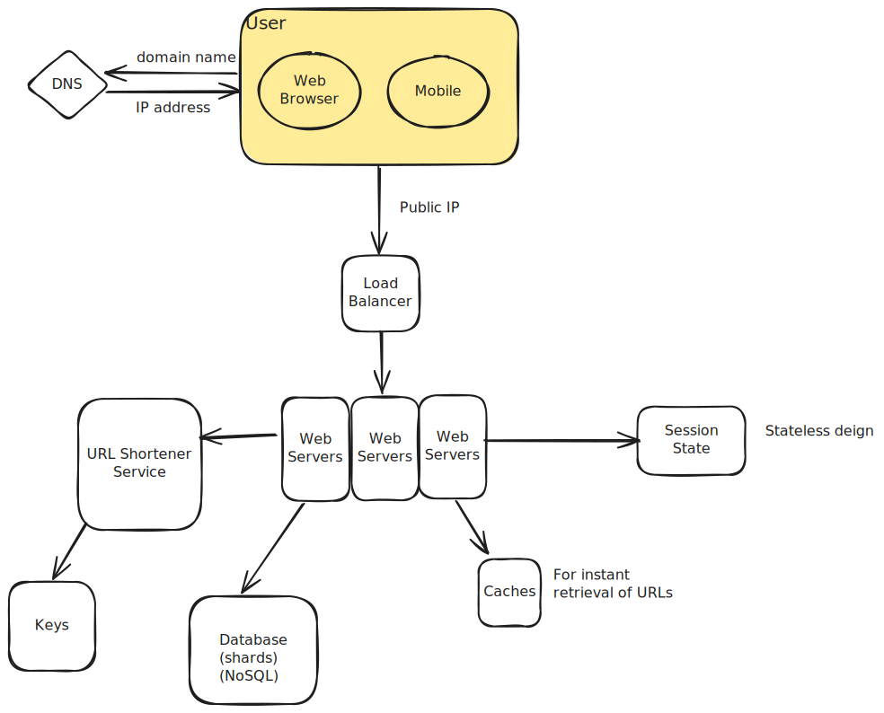
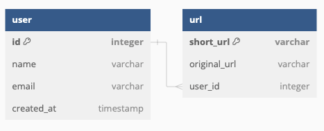

---
layout: page
title: Developer Guide
--- 

## TinyURL 

## Table of Contents
- [**Design**](#design)
    - [**API Design**](#api-design)
    - [**Database Schema**](#database-schema)
    - [**Shortening Algorithm**](#shortening-algorithm)
- [**Structure**](#structure)
    - [**Error Handling**](#error-handling)
- [**Requirements**](#requirements)
    - [**User Stories**](#user-stories)
    - [**Non-Functional Requirements**](#non-functional-requirements)
    - [**Estimation**](#estimation)
    - [**Glossary**](#glossary)

## Design

- **Load Balancers**: distribute traffic accross multiple web instances
- **Session State**: Use a NoSQL database to store session state
- **URL Shortener Service**: Responsible for generating short URLs, storing URL mappings and retrieivng original URLs

### API Design
1. `POST /api/login`
2. `POST /api/signup`
    - To create a User
3. `POST /api/urls`
    - To create a short URL 
    - Input: JSON payload with the longURL 
    - Output: The short URL generated 
4. `GET /api/urls`
    - Retrieve all the URLs associated with the particular user
2. `GET /api/urls/{shortURLId}`
    - Output: The original long URL

### Database Schema

- Table URL, it's possible to add more fields for metrics purposes, eg: 
    - clicks
    - creation date

### Shortening Algorithm
- 

## Structure
### Error Handling
I chose to use `@ControllerAdvice` global exception handling instead of using `ResponseStatusExcepion` handling because I feel I don't want to fill my controllers with many `try-catch` blocks and I still find myself needing to create exception classes to handle different errors although `ResponseStatusException` goal was to try to fix this, but this is mainly for the same exception type but providing the flexibility of sending different status error code. 

## Requirements
### User Stories
- As a user, I want to have a shorter URL so that I can have an easier time sharing links
- As a user, I want to view a table of short URLs to long URLs so that I can keep track of which past URLs I have shortened 
### Non-Functional Requirements
- Low latency (100ms)
- High availability 
### Estimation 
- URL life: 10 years = 315.56 million seconds
- 1000 writes per second
- 10000 reads per second
- Total unique URLs in 10 years: 315.56 $\times$ 1000  $=$ 31.5 billion
- 62 character set (alpha-numeric)
- $62^7 = 3.52$ trillion (Use 7 characters to represent unique URLs)
### Glossary 

### Resources
- https://medium.com/gitconnected/system-design-interview-question-design-url-shortener-c3278a99fc35 
- https://medium.com/@sandeep4.verma/system-design-scalable-url-shortener-service-like-tinyurl-106f30f23a82
- https://www.geeksforgeeks.org/system-design-url-shortening-service/
- https://medium.com/homeday/how-does-it-feel-like-with-your-own-url-shortener-serverless-service-5fce0dd1bbec
