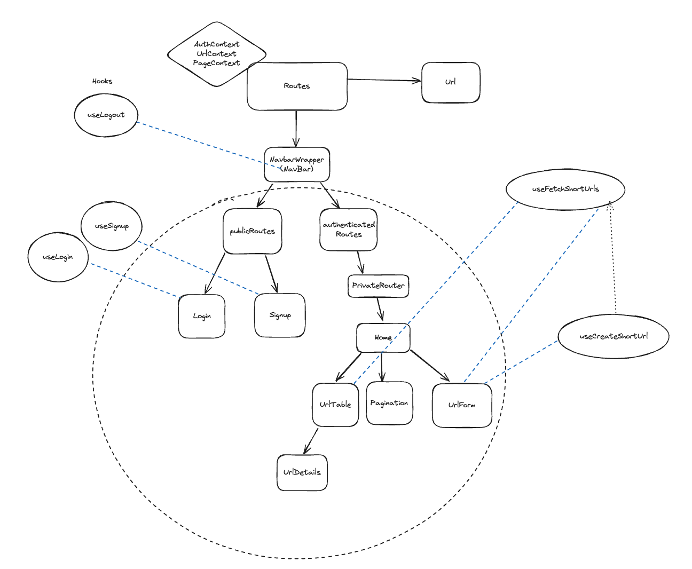
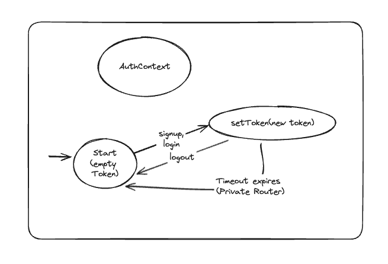
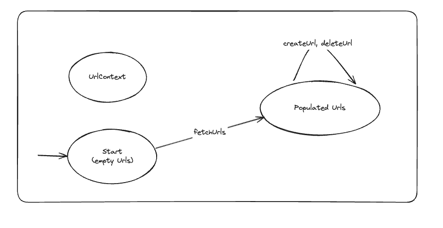
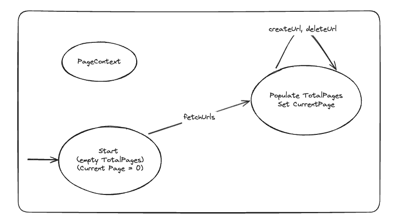

---
layout: page
title: Developer Guide
--- 

## TinyURL 

## Table of Contents
- [TinyURL](#tinyurl)
- [Table of Contents](#table-of-contents)
- [Design](#design)
  - [General Architecture Diagram](#general-architecture-diagram)
  - [Java Spring boot (Backend) Architecture Diagram](#java-spring-boot-backend-architecture-diagram)
  - [React (Frontend) Architecture Diagram](#react-frontend-architecture-diagram)
  - [API Design](#api-design)
  - [Database Schema](#database-schema)
  - [Shortening Algorithm](#shortening-algorithm)
- [Structure](#structure)
  - [Error Handling](#error-handling)
- [Requirements](#requirements)
  - [User Stories](#user-stories)
  - [Non-Functional Requirements](#non-functional-requirements)
  - [Estimation](#estimation)
  - [Glossary](#glossary)
  - [Resources](#resources)


## Design
### General Architecture Diagram

- **Load Balancers**: distribute traffic accross multiple web instances
- **Session State**: Use a NoSQL database to store session state
- **URL Shortener Service**: Responsible for generating short URLs, storing URL mappings and retrieivng original URLs

### Java Spring boot (Backend) Architecture Diagram
**Spring Boot Security**


### React (Frontend) Architecture Diagram

**Context diagrams**
These diagrams are based on the idea of State Diagrams





### API Design

**Public Endpoints**
 -  `POST /api/auth/signup` 

    **Message properties**
    | fields     | Description                                                     |
    | :--------- | :-------------------------------------------------------------- |
    | `email`    | The user email address                                          |
    | `username` | The username which has to be unique in database                 |
    | `password` | The user choice of password that has to meet certain conditions |

    **Response Properties**
    ```json
    {
    "jwt": {The generated jwt token for the user},
    "_links": {
        "urls": {
            "href": {api/urls/{user-id}}
        }
    }
    }
    ```
    **Status code**
    | fields | Description                                   |
    | :----- | :-------------------------------------------- |
    | `400`  | Validation failed: password not strong enough |
    | `409`  | Username or email already taken               |
    
    
- `POST /api/auth/login`

    **Message properties**
    | fields     | Description                                                     |
    | :--------- | :-------------------------------------------------------------- |
    | `username` | The username which has to be unique in database                 |
    | `password` | The user choice of password that has to meet certain conditions |

    **Response Properties**
    ```json
    {
    "jwt": {The generated jwt token for the user},
    "_links": {
        "urls": {
            "href": {/api/urls/{user-id}}
        }
    }
    }
    ```
    **Status code**
    | fields | Description                           |
    | :----- | :------------------------------------ |
    | `404`  | Username does not exists              |
    | `401`  | Invalid credentials, invalid password |

- `GET /api/urls/{shortURLId}`

    **Response Properties**
    ```json
    {
        "shortUrlId": {The shortUrlId generated by the shortener service},
        "longUrl": {The original longUrl given by the user},
        "userId": {User-id},
        "_links": {
            "self": {
                "href": {/api/urls/{user-id}}
            },
            "urls": {
                "href": {/api/urls}
            }
        }
    }
    ```
    **Status code**
    | fields | Description                               |
    | :----- | :---------------------------------------- |
    | `404`  | Url withi this shortUrlId does not exists |

**Authenticated Endpoints**
- `POST /api/urls`

    **Message properties**
    | fields       | Description                                       |
    | :----------- | :------------------------------------------------ |
    | `shortUrlId` | Blank, will be generated by the Shortener service |
    | `longUrl`    | The long Url given by the user to shorten         |
    | `userId`     | The User Id                                       |

    **Response Properties**
    ```json
    {
        "shortUrlId": {The shortUrlId generated by the shortener service},
        "longUrl": {The original longUrl given by the user},
        "userId": {User-id},
        "_links": {
            "self": {
                "href": {/api/urls/{user-id}}
            },
            "urls": {
                "href": {/api/urls}
            }
        }
    }
    ```
    **Status code**
    | fields | Description                      |
    | :----- | :------------------------------- |
    | `400`  | Validation failed, URL constrain |


- `GET /api/urls`

    **Path Variables**
    | Variables | Description                    |
    | :-------- | :----------------------------- |
    | `size`    | The size of the paginated page |
    | `page`    | The page number                |

   **Response Properties**
    ```json
    {
        "_embedded": {
            "urls": [
                {
                    "shortUrlId": {The shortUrlId generated by the shortener service},
                    "longUrl": {The original longUrl given by the user},
                    "userId": {User-id},
                    "_links": {
                        "self": {
                            "href": {/api/urls/{user-id}}
                        },
                        "urls": {
                            "href": {/api/urls}
                        }
                    }
                }
            ]
        },
        "_links": {
            "self": {
                "href": {The current HAL link}
            }
        },
        "page": {
            "size": {The size of each page},
            "totalElements": {The total number of URL links},
            "totalPages":  {The total number of pages}, 
            "number": {0-indexed page number}
        }
    }
    ```
    **Status code**
    | fields | Description                              |
    | :----- | :--------------------------------------- |
    | `404`  | Url with this shortUrlId does not exists |


- `DELETE /api/urls/{shortURLId}`

    **Response Properties**
    ```json
    {
        "success": {Boolean, whether or not it was successful or not}
    }
    ```
    **Status code**
    | fields | Description                              |
    | :----- | :--------------------------------------- |
    | `404`  | Url with this shortUrlId does not exists |

### Database Schema
I chose a NoSql design because of the high read-write requests that will be expected of the application. The only purpose of using a relational database for this application is the consideration of race-conditions where 2 users decide to shorten a longUrl with the shortening algorithm generating a similar shortUrlId (In the case of a distributed environment), the use of a relational database will be able to ensure consistency of data. However in a NoSql database this isn't the case and could cause an issue. A point in consideration is to seperate the shortener service to a microservice that has its own independent relational database to generate the shortUrlIds. 


- Table URL, it's possible to add more fields for metrics purposes, eg: 
    - clicks
    - creation date

### Shortening Algorithm
I chose to use a simple random generator for the shortUrlId with a backoff algorithm that will sent out an error just in case it took too long to generate a random shortUrlId.

I did not use a base conversion technique. While it make ensure uniqueness in the generation of the shortUrlId, the generation is in linear order and could be predictable. I didn't use a hashing algorithm because of the possibility of a collision that could happen, while it is unlikely. 

## Structure
### Error Handling
I chose to use `@ControllerAdvice` global exception handling instead of using `ResponseStatusExcepion` handling because I don't want to fill my controllers with many `try-catch` blocks and I still find myself needing to create exception classes to handle different errors. `ResponseStatusException` goal was to try to fix this, but this is mainly for the same exception type but providing the flexibility of sending different status error code which doesn't fit in my user. 

## Requirements
### User Stories
- As a user, I want to have a shorter URL so that I can have an easier time sharing links
- As a user, I want to view a table of short URLs to long URLs so that I can keep track of which past URLs I have shortened 
- As a user, I want to be able to delete a short URL mapping 
- As a user, I want my short URL to be accessible to anyone so I can share with people 
- As a user, I want to be able to share my a QR code for my shortURL for easier accessbility 

### Non-Functional Requirements
- Low latency (100ms)
- High availability 
### Estimation 
- URL life: 10 years = 315.56 million seconds
- 1000 writes per second
- 10000 reads per second
- Total unique URLs in 10 years: 315.56 $\times$ 1000  $=$ 31.5 billion
- 62 character set (alpha-numeric)
- $62^7 = 3.52$ trillion (Use 7 characters to represent unique URLs)
### Glossary 

### Resources
- https://medium.com/gitconnected/system-design-interview-question-design-url-shortener-c3278a99fc35 
- https://medium.com/@sandeep4.verma/system-design-scalable-url-shortener-service-like-tinyurl-106f30f23a82
- https://www.geeksforgeeks.org/system-design-url-shortening-service/
- https://medium.com/homeday/how-does-it-feel-like-with-your-own-url-shortener-serverless-service-5fce0dd1bbec
